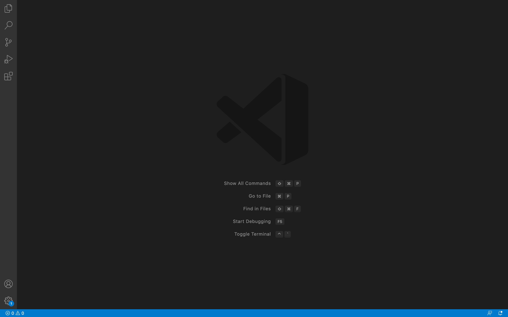
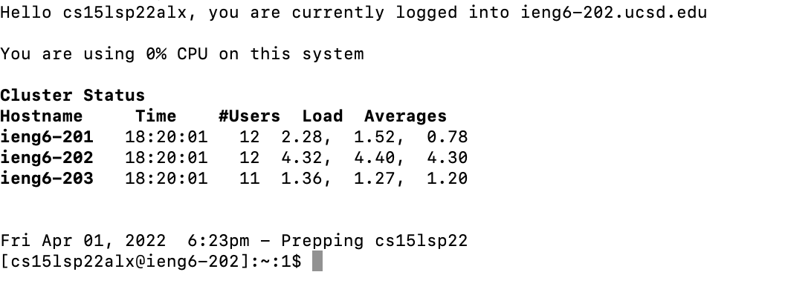
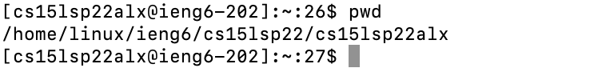
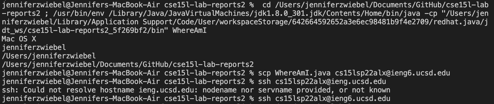
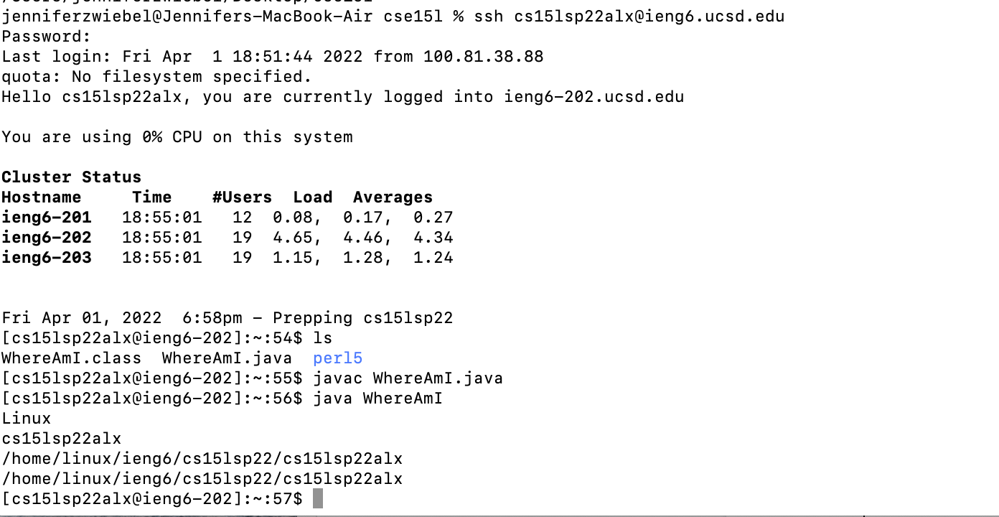

# Lab Report 1

How to log into a course-specific account on `ieng6`. :tree:

### Installing Visual Studio Code
---
Visual Studio Code is a useful text editor that can be used to write, debug, and run code. To install VS Code, follow these steps:
1. Go to the Visual Studio Code [website](https://code.visualstudio.com/).
2. Click on the blue Download button on the top right corner of the website. Select the version to download that works with your computer.

3. Follow the remaining instructions given by VS Code to complete the installation. Once completed, you will be able to open the following page:

 

 

### Remotely Connecting
---
1. Open a terminal in VS Code by clicking Terminal --> New Terminal
2. Type `ssh cs15lsp22zzz@ieng6.ucsd.edu` into the terminal, replacing 'zzz' with the three unique letters you get for your account.
3. A message may pop up asking you if you want to continue connecting. Type `yes` and enter and then type your password. Now you should be remotely connected to a computer in the CSE basement.

The following should appear on your terminal once you have remotely connected:

 

 

### Trying Some Commands
---
1. Try typing in some commands to the terminal. Some commands to try are `cd`, `ls`, `pwd`, `mkdir`, `cp`, and their variations.
2. One example of a command I ran was the `pwd` command which printed the path to the current folder I was in.
 

### Moving files with scp
---
1. Log out of the remote server by typing `exit` and hitting enter
2. To move a file from your local computer to the server, type `scp filename.java cs15lsp22zzz@ieng6.ucsd.edu` replacing filename with the name of the file you wish to move and 'zzz' with the unique letters for your account.
 

An example is shown in the images below. The first screenshot shows running a file called WhereAmI.java from the client and then running the scp command on the WhereAmI file. The second screenshot shows connecting to the server and shows that the file WhereAmI.java is now there. Then WhereAmI.java is run from the remote server.
 

 

### Setting an SSH Key

### Optimizing Remote Running

