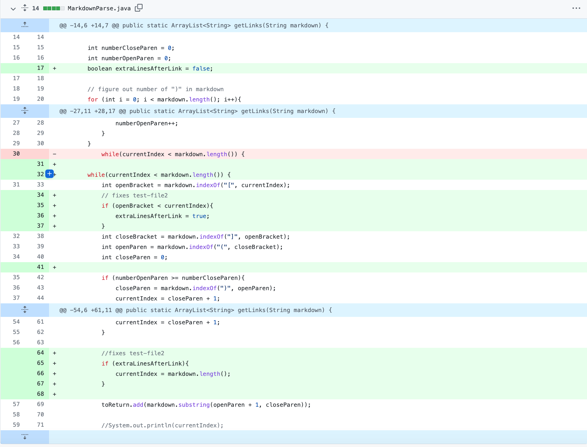

### Bug 1: Text after the links 
**(test-file2)**

 

Link to failure inducing file: [test-file2](https://JZ567.github.io/markdown-parser/test-file2.md)

### Bug 2: Empty brackets with no link following 
**(test-file3)**

 

Link to failure inducing file: [test-file3](https://JZ567.github.io/markdown-parser/test-file3.md)

### Bug 3: Parenthesis within the link
**(custom test file)**

 

Link to failure inducing file: [test-file-extra-parenthesis](https://JZ567.github.io/markdown-parser/test-file-extra-parenthesis.md)

