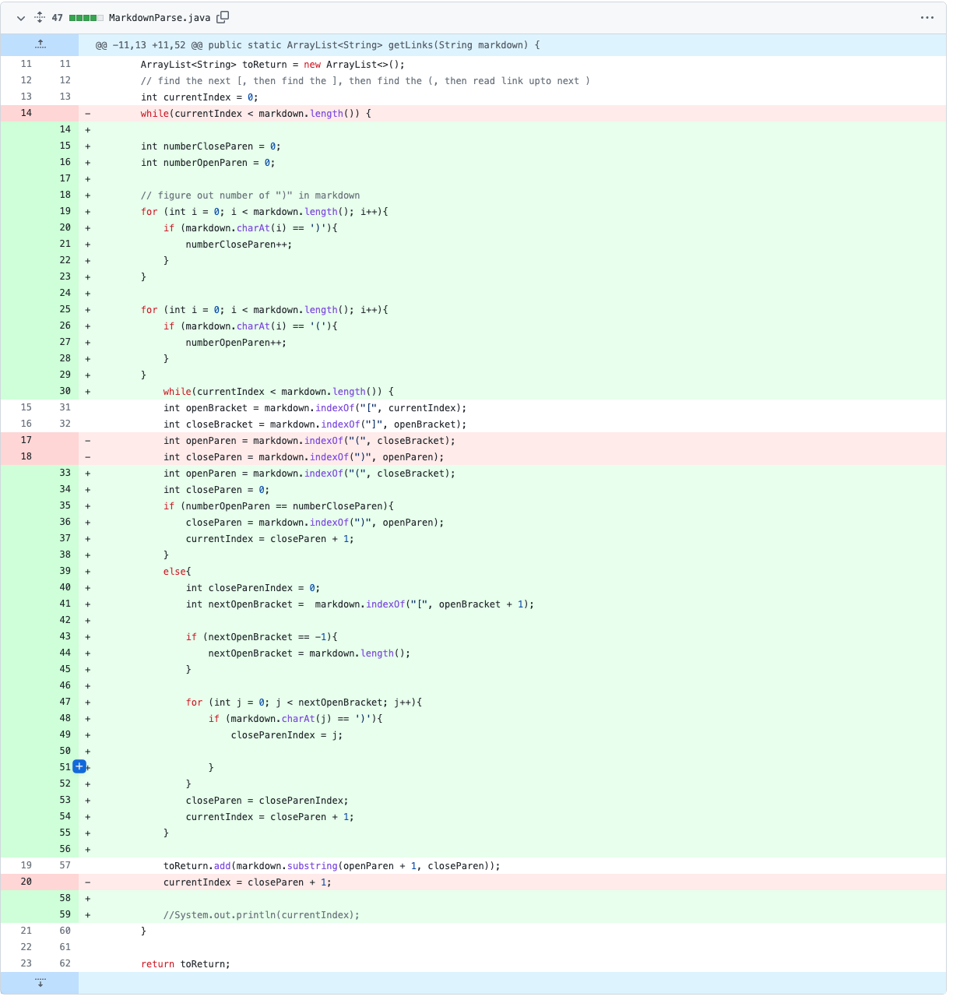

# Lab Report 2

### Bug 1: Text after the links 
 

Code change diff:

 

Link to failure inducing file: [test-file2](https://JZ567.github.io/cse15l-lab-reports/test-file2.html)

 

Symptom for failure inducing input:

The symptom was a heap space error since the code was running an infinite while loop. This is because there was a bug where this input caused the variable currentIndex to always be less than markdown.length(), so the code would be stuck in the while loop. To solve this, I tracked if the variable openBracket is less than the variable currentIndex, and if so, set the current index to markdown.length() to get out of the while loop.

### Bug 2: Empty brackets with no link following 
 

Code change diff:

 

Link to failure inducing file: [test-file3](https://JZ567.github.io/cse15l-lab-reports/test-file3.html)

 

Symptom for failure inducing input:

The symptom was an IndexOutOfBoundsException since the variable openParen would be set to -1. This is because in this input, there are no open parenthesis, so the variable openParen would be set to -1. To solve this, I looked to see if the variable openParen was equal to -1, and if so, returned an empty ArrayList.

### Bug 3: Parenthesis within the link
 

Code change diff:

 

Link to failure inducing file: [test-file-extra-parenthesis](https://JZ567.github.io/cse15l-lab-reports/test-file-extra-parenthesis.html)

 

Symptom for failure inducing input:

Like Bug 1, The symptom was a heap space error since the code was running an infinite while loop. This is because there was a bug where this input caused the code to not be able to find the correct end of the link since the code tracks the first closed parenthesis, but we really want to find the last closed parenthesis. To solve this, I created a for loop that would find the last close parenthesis before the next open bracket and set the variable closeParen to this index.

