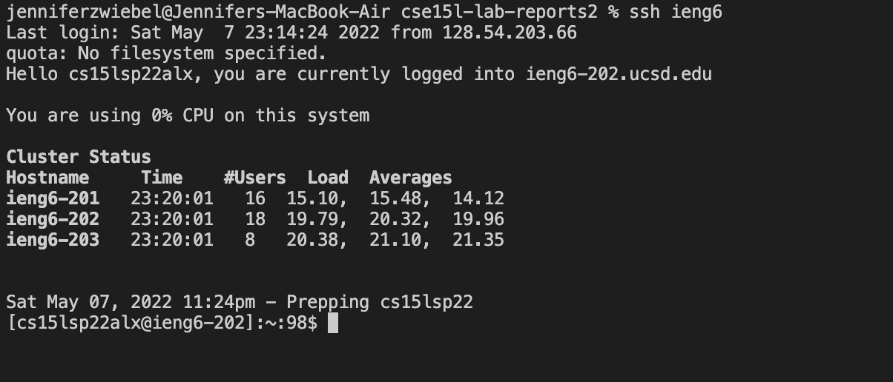
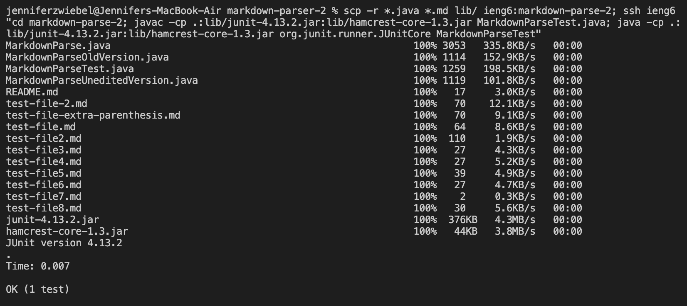

# Lab Report 3

## Streamlining ssh Configuration

In this part of the lab, we changed the ssh login so that we would only have to type 'ieng6' instead of the entire 12 character username

Screenshot of .ssh/config file: 

 

Screenshot of ssh command logging me into my account:

 

Screenshot of scp command with alias:

 

## Setup Github Access from ieng6

First, I created an ssh key from my ieng6 account.
Then, I typed in `cat ~/. ssh/id_rsa_github.pub` to copy the contents of id_rsa_github.pub to my clipboard and added it to Github.

 

The git commit command words, but ynfortunately the git push command is not working from the ieng6 server. 
Here is a screenshot of what shows instead: 

 

There were no office/tutor hours today, but I will try get help on this and resubmit during the resubmission period.

## Copy whole directories with scp -r

For this step, we copied the whole markdown-parser-2 directory with the scp command to the ieng6 server.

 

We can then compile and run the tests from the ieng server.

 

Lastly, we can combine these steps into one line:

