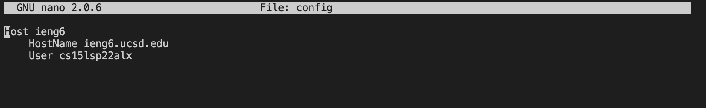

# Lab Report 3

## Streamlining ssh Configuration

In this part of the lab, we changed the ssh login so that we would only have to type 'ieng6' instead of the entire 12 character username

Screenshot of .ssh/config file: 

 

Screenshot of ssh command logging me into my account:

 

Screenshot of scp command with alias:

 

## Setup Github Access from ieng6

In this part of the lab, we set up Github access from the ieng6 account, so that we can type git commands in the terminal to commit and push from the command line.

First, I created an ssh key from my ieng6 account.
Then, I typed in `cat ~/. ssh/id_rsa.pub` to copy the contents of id_rsa.pub to my clipboard and added it to Github.

 

Running git commands to commit and push a change to Github while logged into ieng6 account:

 

Link to the commit: [link](https://github.com/JZ567/markdown-parser-2/blob/main/MarkdownParse.java)

## Copy whole directories with scp -r

For this step, we copied the whole markdown-parser-2 directory with the scp command to the ieng6 server.

 

We can then compile and run the tests from the ieng server.

 

Lastly, we can combine these steps into one line:

