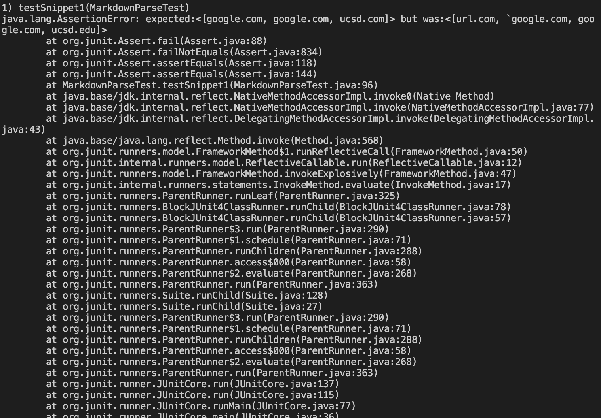
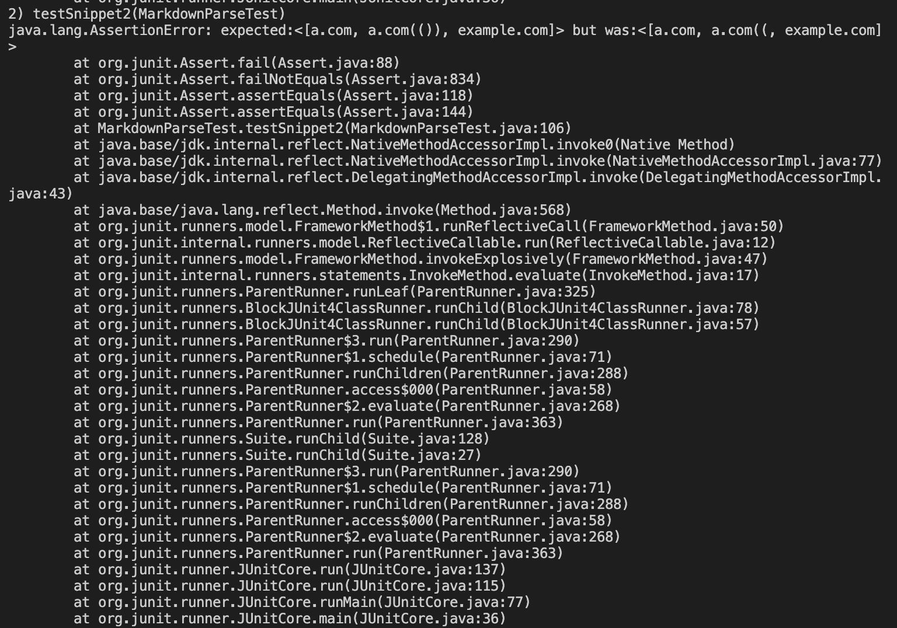

# Lab Report 4
 

Link to my markdown-parse repository: [Link](https://github.com/JZ567/markdown-parser-2)

Link to markdown-parse repository reviewed in week 7: [Link](https://github.com/YoavGutmanUCSD/markdown-parser-2)

 

## Snippet 1

Expected output: `["%60google.com", "google.com", "ucsd.com"]`

Code in MarkdownParseTest.java: 

 

The test did not pass for my implementation. Output when running test for my implementation:

 

The test did not pass for the peer implementation I reviewed in week 7. Output when running test for this implementation:

 

## Snippet 2

Expected output: `["a.com", "a.com(())", "example.com"]`

Code in MarkdownParseTest.java: 

 

The test did not pass for my implementation. Output when running test for my implementation:

 

The test did not pass for the peer implementation I reviewed in week 7. Output when running test for this implementation:

 

## Snippet 3

Expected output: `["https://www.twitter.com", "https://sites.google.com/eng.ucsd.edu/cse-15l-spring-2022/schedule", "https://cse.ucsd.edu/"]`

Code in MarkdownParseTest.java: 

 

The test did not pass for my implementation. Output when running test for my implementation:

 

The test did not pass for the peer implementation I reviewed in week 7. Output when running test for this implementation:

 
 

1. I think the change to make the program work for snippet 1 and all related cases that use inline code with backticks would be more involved then 10 lines. You could make a change to the code where you check for the indeces of the backticks. If both backticks are within the square brackets, then the code stays the same. If one backtick is within the square brackets and the other isn't, then you skip the following link and move on to the next open bracket. If there is one backtick within the parenthesis, and one outside, remove the backtick from the link. 

2. I think the change to make the program work for snippet 2 would be more involved. Like the example we saw in Lab 8, it would involve creating a function to find the last close parenthesis (or bracket) by counting the total open parenthesis/brackets and then subtracting the number of close parenthesis/brackets.

3. Yes, I think there is a small code change that could make the program work for snippet 3 and all related cases that have newlines in brackets and parenthesis. You could find if the indeces for the newlines fall within a pair of brackets or parenthesis. If so, then start the substring that goes into toReturn after the newlines that come before the link and end it before the newlines that come after the link.
