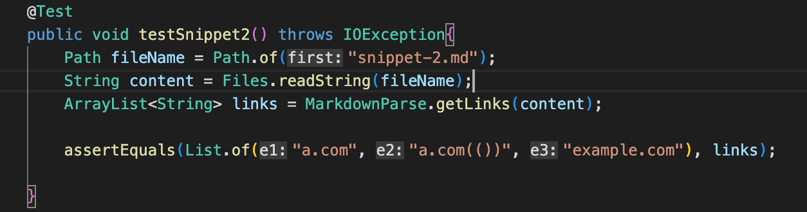

# Lab Report 4
 

Link to my markdown-parse repository: [Link](https://github.com/JZ567/markdown-parser-2)

Link to markdown-parse repository reviewed in week 7: [Link](https://github.com/YoavGutmanUCSD/markdown-parser-2)

 

## Snippet 1

Expected output: `["google.com", "google.com", "ucsd.com"]`

Code in MarkdownParseTest.java: 

 

The test did not pass for my implementation. Output when running test for my implementation:

 

## Snippet 2

Expected output: `["a.com", "a.com(())", "example.com"]`

Code in MarkdownParseTest.java: 

 

The test did not pass for my implementation. Output when running test for my implementation:

 

## Snippet 3

Expected output: `["https://www.twitter.com", "https://sites.google.com/eng.ucsd.edu/cse-15l-spring-2022/schedule", "https://cse.ucsd.edu/"]`

Code in MarkdownParseTest.java: 

 

The test did not pass for my implementation. Output when running test for my implementation:

