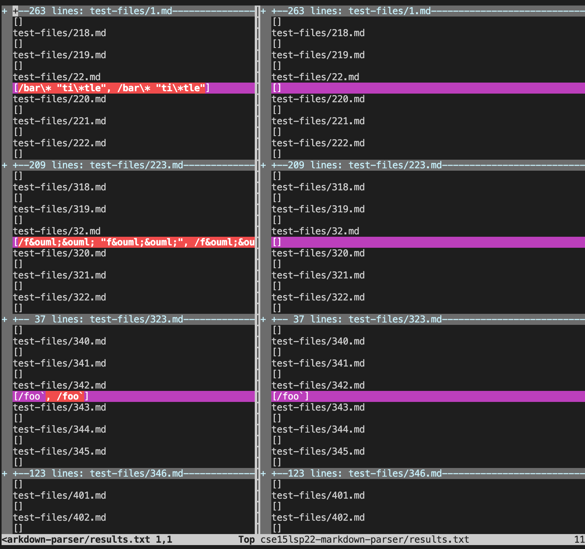
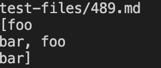
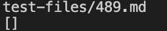
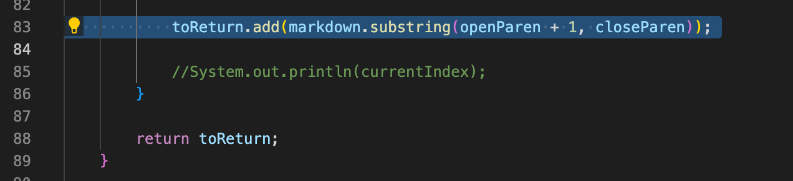
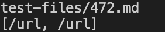
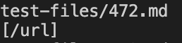

# Lab Report 5
 

I found the tests with different results by first generating output from each implementation using the script.sh file. Then, I put the output into two different results.txt files using output redirection. Then I used `vimdiff` to see the differences between the two results files. The output of the vimdiff command looked like: 

 

## Test 1: Test File 489

Link to test file: [Link](https://github.com/nidhidhamnani/markdown-parser/blob/main/test-files/489.html.test)

The provided implementation is correct.

 

My implementation output:

 

Provided implementation output:

 

Expected output: ` ` (empty, no links)

 

The program is not taking into account the newline that is between the parenthesis. So, it is counting the two words as a link when they shouldn't be counted as a link. To fix this, I would need to add an if statement that checks that the index of `"\n"` is -1 before adding the link. This if statement would go before adding the link, which is before line 84 in this screenshot:

## Test 2: Test File 472

Link to test file: [Link](https://github.com/nidhidhamnani/markdown-parser/blob/main/test-files/472.html.test)

The provided implementation is correct.

 

My implementation output:

 

Provided implementation output:

 

Expected output: `/url` 

 

The program is doubling the output. This is because the while loop is running twice when it should only be running once. To fix this, I need to update currentIndex, which should be done after adding the link to toReturn but before exiting the while loop. This would also be after line 84 in this screenshot:

